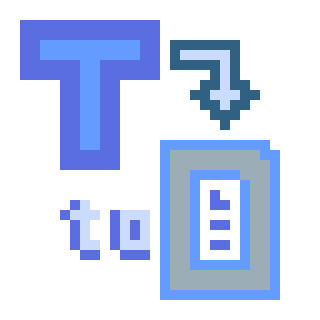
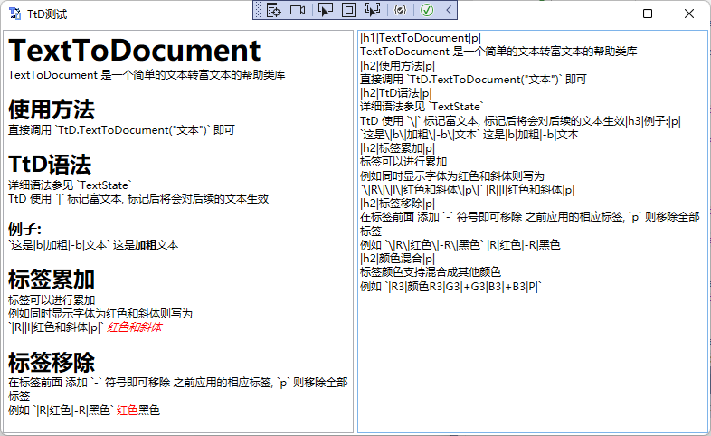

# TextToDocument



TextToDocument 是一个简单的富文本格式化语言
本类库将会帮助用户转换TtD文本为富文本

## 使用方法

直接调用 `TtD.TextToDocument("文本")` 即可

## TtD语法

详细语法参见 [`TextState`](https://github.com/LorisYounger/TextToDocument/blob/main/TextToDocument/TtD.cs#L18)

TtD 使用 `|` 标记富文本, 标记后将会对后续的文本生效

### 例子:

```
|h1|这是个标题|p|
这是文本
这是|b|加粗|-b|文本
```

#### 显示效果

<h1>这是个标题</h1>
<p>这是文本</p>
<p>这是<b>加粗</b>文本</p>


### 常用标签

| 标签   | 描述                                  |
| ------ | ------------------------------------- |
| \|P\|  | 清空所有富文本设置,使用默认值输出文本 |
| \|H1\| | 设置为1级标题 总共6级标题可设置       |
| \|B\|  | 加粗文本                              |
| \|I\|  | 斜体文本                              |
| \|R\|  | 字体显示为红色                        |

### 标签累加

标签可以进行累加
例如同时显示字体为红色和斜体则写为 `|R||I|红色和斜体` *<font color=#FF0000 >红色和斜体</font>*

### 标签移除

在标签前面 添加 `-` 符号即可移除 之前应用的相应标签, `p` 则移除全部标签
例如 `|R|红色|-R|黑色` 显示为 <font color=#FF0000>红色</font>黑色

### 颜色混合

标签颜色支持混合成其他颜色
例如 `|R3|颜色R3|G3|+G3|B3|+B3` <font color=#C00>颜色R3</font><font color=#CC0>+G3</font><font color=#CCc>+B3</font>

## 如何使用

1. 通过Parckage Manager

```
Install-Package TextToDocument
```

2. 通过nuget.org

   [TextToDocument](https://www.nuget.org/packages/TextToDocument/)

3. 下载nuget包

   [Nuget文件夹](https://github.com/LorisYounger/TextToDocument/tree/master/nuget)

## DEMO


